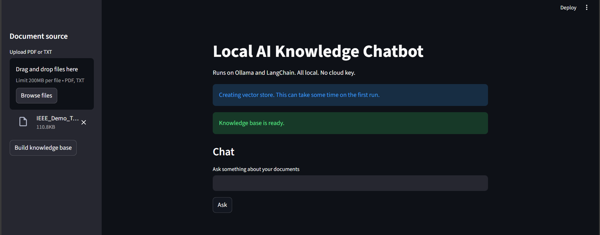
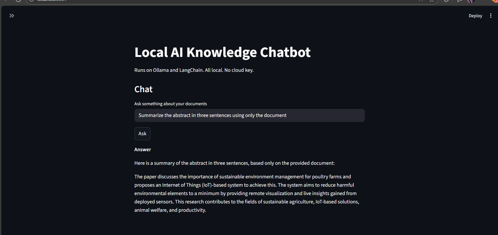

# Local AI Knowledge Chatbot

Runs completely on a local machine using Ollama and LangChain. No cloud key is required.

This app lets a user  
1. Upload PDF or text documents  
2. Build a local vector store using sentence transformer embeddings  
3. Ask questions about the uploaded content  
4. Get answers from a local language model served by Ollama  

The goal is to show a simple but complete Retrieval Augmented Generation pipeline that anyone can run on Windows.

## Features

1. Local model through Ollama (tested with `llama3`)  
2. Document loader for PDF and TXT  
3. Text splitting using `langchain-text-splitters`  
4. Vector store using Chroma with persistence  
5. Streamlit user interface  
6. Works in a virtual environment  
7. Good starter project for machine learning or data science portfolios  

## Prerequisites

1. Windows 10 or 11  
2. [Ollama](https://ollama.com/) installed and running  
   Ollama must be available at `http://localhost:11434`  
3. Python 3.12 or newer  
4. Git  

## Setup

Run these commands in PowerShell in order  

1. `git clone https://github.com/Hanif5043/local-ai-chatbot.git`  
2. `cd local-ai-chatbot`  
3. `python -m venv venv`  
4. `venv\Scripts\activate`  
5. `pip install -r requirements.txt`  

## Running the app

1. Activate the virtual environment if it is not already active  
2. Run `streamlit run app.py`  
3. Open the link shown in the terminal, usually `http://localhost:8501`  

## Demo

Here are some screenshots of the working application  

### Building Knowledge Base

### Asking Questions

